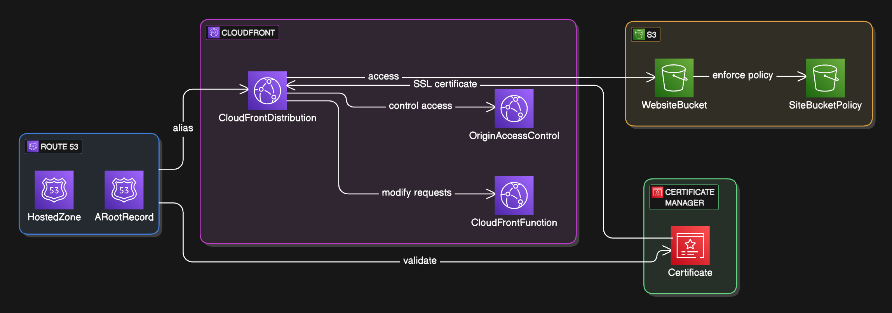
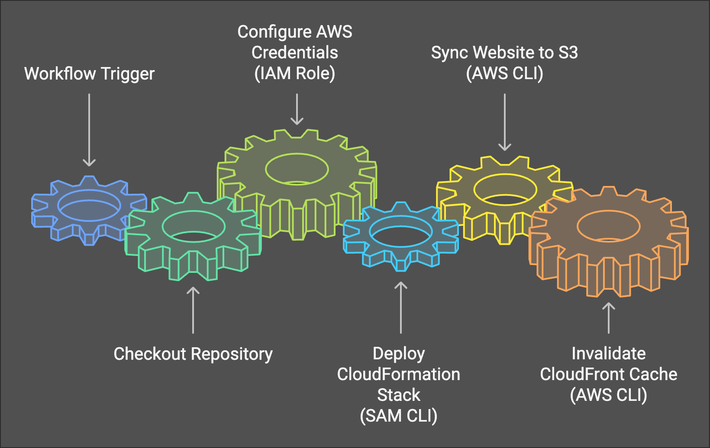
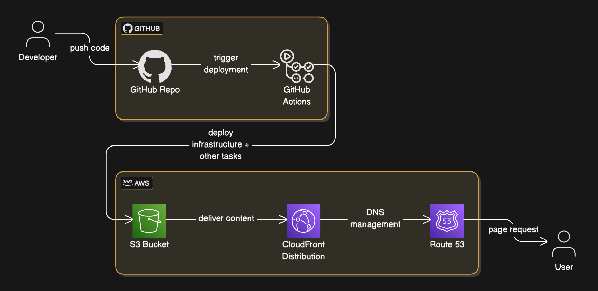
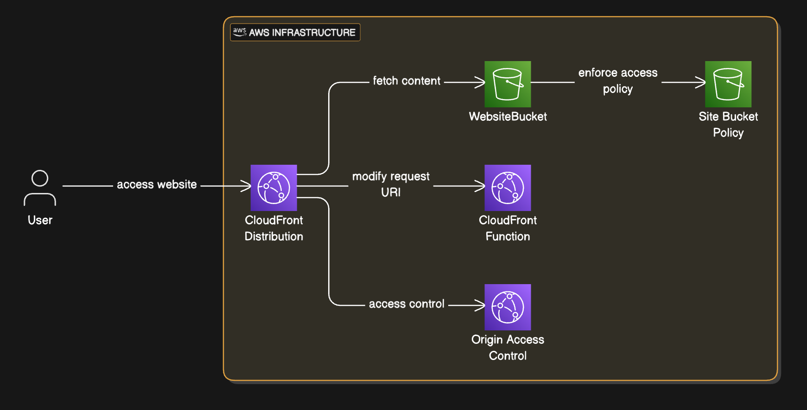

# Static Website on AWS – Example Project

## Table of Contents
1. [Project Overview](#project-overview)
2. [Features](#features)
3. [Architecture Diagram](#architecture-diagram)
4. [Prerequisites](#prerequisites)
5. [Usage](#usage)
6. [Deployment Pipeline](#deployment-pipeline)
7. [Contributing](#contributing)
8. [License](#license)

## Project Overview

This project is designed to help you quickly spin up a secure static website on AWS, complete with:
  - **Infrastructure as Code (IaC)**: A simple AWS CloudFormation template ([`template.yml`](./cloudformation-basic-site/template.yml)) that provisions all necessary AWS resources.
  - **Custom Domain & HTTPS**: An example workflow for handling a custom domain via Route53 and issuing an SSL certificate through AWS Certificate Manager.
  - **GitHub Actions Workflow**: An automated pipeline ([`deploy-cloudformation-basic-site.yml`](./.github/workflows/deploy-cloudformation-basic-site.yml)) that deploys to AWS and synchronizes site files to S3.

The HTML pages (`index.html`, `404.html`, etc.) serve as a basic demonstration of how your static site’s content will be delivered.

> [!NOTE]
> This project is meant to serve as a reference and should not be used a complete turn-key solution. You will need to make modifications where necesaary to integrate this pattern into your own project.

## Features
1. **Fully Automated Deployment**  
   Use the provided GitHub Actions workflow definition to handle the entire deployment process.

2. **AWS CloudFormation Setup**  
   - S3 bucket for hosting the website files.  
   - CloudFront distribution for fast, global content delivery.  
   - Route53 Hosted Zone and DNS records for a custom domain (optional).  
   - AWS Certificate Manager for an HTTPS certificate (optional).

3. **Security Best Practices**  
   - Origin Access Control (OAC) ensures CloudFront is the only service allowed to read from the S3 bucket.  
   - TLS/SSL enforcement that redirects all traffic to HTTPS.

## Architecture Diagram

1. **S3 Bucket** holds static files (HTML, CSS, JS, images).  
2. **CloudFront** provides global edge network caching for performance and security.  
3. **Route53** manages DNS settings for a custom domain (optional).  
4. **AWS Certificate Manager** issues an SSL certificate for HTTPS.  

---

**Key Files**:
- **`template.yml`** – Defines all AWS resources: S3 bucket, CloudFront distribution, Route53 records, and SSL certificate.  
- **`deploy-cloudformation-basic-site.yml`** (GitHub Actions Workflow) – Automates deployment to AWS.  
- **`index.html`** – Example homepage.  

## Prerequisites

1. **AWS Account** – You will need an AWS account with permissions to deploy CloudFormation stacks and manage Route53, S3, CloudFront, and Certificate Manager.
2. **Domain Name (optional)** – If using a custom domain, ensure you have a registered domain and Route53 hosted zone set up.
3. **GitHub Repository** – Fork this repository or clone and take what you need. You will need to use a Github repository if you plan to use the included GitHub Actions workflow.
4. **AWS CLI & SAM CLI** – Useful for local testing or deploying from the command line.

## Usage

### 1. Configure CloudFormation Parameters
Within the CloudFormation template (`template.yml`), you will find parameters such as `DomainName`. If you plan to use a custom domain name, include the domain name as a parameter override whenever executing `sam deploy` (e.g. in the Github workflow). If you do not need a custom domain, you can ignore these references or remove them as needed.

### 2. Set Up AWS Credentials
The GitHub Actions workflow (`deploy-cloudformation-basic-site.yml`) relies on AWS credentials or an assumed IAM role to manage resources. Update the `Configure AWS credentials` step with your preferred method for accessing AWS:

    - name: Configure AWS credentials
      uses: aws-actions/configure-aws-credentials@v4
      with:
        role-to-assume: arn:aws:iam::123456789012:role/YourDeploymentRole
        aws-region: us-east-1

[This AWS blog post](https://aws.amazon.com/blogs/security/use-iam-roles-to-connect-github-actions-to-actions-in-aws/) describes how to set up your IAM Role for Github actions.

### 3. Deploy the Stack
When the GitHub Actions workflow runs:
1. It deploys or updates the CloudFormation stack using the `template.yml`.
2. It retrieves the newly created S3 bucket name from the stack outputs.
3. It uploads all files in the `website/` directory to that S3 bucket.
4. It invalidates the CloudFront distribution cache so changes are served immediately.

If you do include a Github workflow for your project, including a trigger on commits to main branch is common. Continuous integration!

You can also deploy manually with SAM/CloudFormation from your local machine:

    cd cloudformation-basic-site
    sam deploy --guided

Follow the prompts to configure your stack name, AWS region, and any parameter overrides (such as `DomainName`).

> [!CAUTION]
> Instead of deploying the entire stack with all of its resource on the first deployment, consider starting small with one resource (e.g. the S3 bucket) first. Then, you can add additional resources with each subsequent deployment. Some resources like CloudFront distributions, hosted zones, and SSL certificates take many minutes to deploy. A failed deployment may also take several minutes to rollback.

### 4. Test the Website
After deployment:
1. Note the **CloudFront Domain Name** (returned in the stack outputs).  
2. Access the website by pointing your browser to that domain.  
3. If you added a custom domain, confirm your DNS settings in Route53, and wait for DNS propagation (which can take up to 24 hours).

You can always access the website from the CloudFront distribution endpoint, even if you are using a custom domain.

## Contributing
Contributions are welcome! If you have suggestions, encounter bugs, or have feature requests, feel free to open an [Issue](../../issues) or submit a [Pull Request](../../pulls).

## License
This project is open source and available under the [MIT License](LICENSE).  
You are free to use, modify, and distribute this software as needed.
